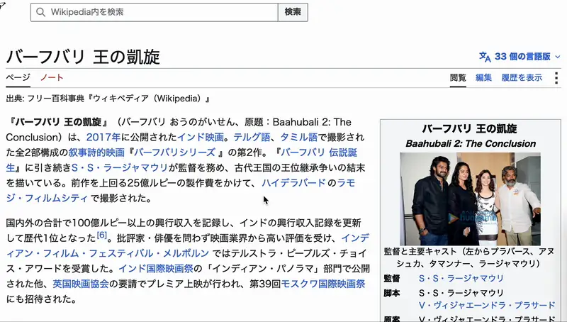

# Blip

[English](README.md)

マウスカーソルを見つける。

マルチディスプレイでカーソルを見失ったときに、その位置を目立たせる macOS のメニューバーユーティリティです。ホットキーを押すか、修飾キーを 2 回押すと、カーソルのある場所が光ります。macOS 13 以降が必要です。

## 動作環境

- Apple Silicon の macOS 13 以降（Intel Mac には対応しません）
- Xcode（xcodebuild と XCTest のため）
- XcodeGen（`brew install xcodegen`）。project.yml から Blip.xcodeproj を生成します

## ビルドと起動

```
./build.sh
open Blip.app
```

build.sh は次の手順を実行します。

1. XcodeGen で project.yml から Blip.xcodeproj を生成する。ビルドのたびに実行するので、追加したソースが自動的に拾われる。Blip.xcodeproj はビルド生成物でありコミットしない
2. xcodebuild で Release 構成をビルドし、できた Blip.app をリポジトリ直下にコピーする。Info.plist とリソースバンドルは Xcode が扱う
3. Scripts/make-icon.swift でアプリアイコンを描き、Scripts/make-icns.sh で icns に変換して同梱する。バンドルのアイコンは薄いグレーの角丸四角に乗せる。About パネルは板なしの線画で、ライトモードは黒、ダークモードは白
4. アプリに署名する。キーチェーンに Developer ID Application 証明書があればそれを使い、無ければアドホック署名になる。CODESIGN_IDENTITY 環境変数で証明書を指定できる

```
CODESIGN_IDENTITY="Apple Development" ./build.sh
```

アドホック署名は再ビルドのたびに変わるため、Input Monitoring の許可が無効になることがあります。証明書で署名するとアプリの同一性が保たれます。

Xcode で開くこともできます。`xcodegen generate` を実行してから Blip.xcodeproj を開いてください。

## テスト

```
./test.sh
```

テストスイートは 2 つあり、test.sh は両方を実行します。

- BlipCoreTests（`swift test`）: AppKit に依存しないロジック（座標計算、2 回押しの判定、エフェクトのタイミング、修飾キーのキーコード）
- BlipTests（`xcodebuild test -scheme Blip`）: アプリ本体。各エフェクトをオフスクリーンのビットマップに描いてピクセル単位で検査するほか、オーバーレイウインドウの構成と張り直し、設定の永続化、設定画面のコントロール、メニュー、起動シーケンス、文字列テーブルの整合を対象にする。アプリをホストにして実行する

イベントタップの生成と Input Monitoring の許可取得は、OS のダイアログでユーザーが許可する操作に依存するため、テストの対象外とし手作業で確認します。タップのイベントを 2 回押しと判定する部分は純粋関数で、テストで担保しています。

BlipCore のカバレッジは次で計測します。

```
swift test --enable-code-coverage
xcrun llvm-cov report .build/debug/BlipCorePackageTests.xctest/Contents/MacOS/BlipCorePackageTests \
  -instr-profile .build/debug/codecov/default.profdata -ignore-filename-regex='\.build/|Tests/'
```

## リリース

`v*` のタグを push すると、ビルド、公証、公開までが自動で走ります。

```
git tag v0.1.0
git push origin v0.1.0
```

タグは project.yml の `MARKETING_VERSION` と一致している必要があり、ズレているとビルドの前にワークフローが止まります。リリースには 2 つのファイルが付き、どちらも他の Mac で Gatekeeper に止められることなく開けます。

```
Blip-<version>.zip   公証チケットを staple した後に固めたアプリ
Blip-<version>.dmg   同じアプリと、Applications へのリンクを並べたもの
```

ディスクイメージにも個別に公証と staple を行います。ダウンロードした側に quarantine 属性が付くのはイメージそのものだからです。

ワークフローはリポジトリの Secret を 6 つ読みます。

```
Secret                     内容
BUILD_CERTIFICATE_BASE64   Developer ID Application 証明書を .p12 で書き出し base64 にしたもの
P12_PASSWORD               その .p12 の書き出しパスワード
KEYCHAIN_PASSWORD          任意の文字列。ランナー上の一時キーチェーンを開けるために使う
NOTARY_KEY_ID              App Store Connect API キーの Key ID
NOTARY_ISSUER_ID           App Store Connect の Issuer ID
NOTARY_KEY_P8_BASE64       .p8 の API キーを base64 にしたもの
```

同じ手順を手元でも実行できます。資格情報は `xcrun notarytool store-credentials` で保存したプロファイルを使います。ディスクイメージの作成には create-dmg が必要で（`brew install create-dmg`）、ボリュームのウインドウを整えるために Finder を操作するので、実行中にウインドウが開閉します。

```
./build.sh
NOTARY_KEYCHAIN_PROFILE=blip ./Scripts/notarize.sh
./Scripts/make-dmg.sh
NOTARY_KEYCHAIN_PROFILE=blip ./Scripts/notarize.sh Blip-<version>.dmg
```

## 使い方

Blip はメニューバーにカーソルのアイコンを置き、Dock には現れません。

```
メニュー項目        動作
Show Spotlight     エフェクトをその場で表示する
Settings…          設定画面を開く（⌘,）
About Blip         About パネルを開く
Restart Blip       終了して起動し直す
Quit Blip          終了する（⌘Q）
```

エフェクトを出す方法は 2 つあり、どちらも設定画面で変更できます。

- ホットキー（既定 ⌥⌘Z）。欄をクリックしてキーを押すと記録されます。修飾キーとキーの組み合わせ、またはファンクションキー単独を登録できます
- 修飾キーの 2 回押し（既定は左 Control）。Control、Shift、Option、Command の左右から選ぶか、オフにできます

設定画面ではエフェクトの選択と、ログイン時の自動起動も設定できます。

エフェクトは 1.2 秒で消えます。表示中はカーソルを追いかけ、下にあるアプリはそのままクリックできます。ディスプレイが複数ある場合、エフェクトはカーソルのある画面にだけ出て、他の画面は暗転します。

### エフェクト

**Spotlight** は画面を暗転させ、カーソルの周りにリング付きの穴を開けます。



**Zoom** は画面サイズの穴をカーソルに向かって縮めます。


**Flash** はリングを点滅させ、カーソルから波紋を広げます。


**Focus Lines** はマンガの集中線をカーソルに向け、3 コマで揺らします。


## 権限

- ホットキーは Carbon の RegisterEventHotKey（KeyboardShortcuts ライブラリ経由）で登録するため、権限は不要です
- 修飾キーの 2 回押しは、左右を区別するためにキーイベントを監視するので Input Monitoring の権限が必要です。初回起動時に OS のダイアログが出ます。システム設定 > プライバシーとセキュリティ > 入力監視 で Blip を有効にしてください。許可するまで 2 回押しは反応せず、設定画面に状態が表示されます
- エフェクトの表示とカーソル位置の取得に権限は不要です

## 設定の保存先

ホットキー、2 回押しの修飾キー、選択中のエフェクトは UserDefaults（com.dominion525.blip）に保存されます。ログイン時の自動起動は SMAppService で登録し、システム設定のログイン項目に現れます。

表示言語はシステムの設定に従います（英語と日本語）。Blip だけ変える場合は システム設定 > 一般 > 言語と地域 > アプリケーション で指定できます。

## 調整できる値

設定画面に無い値の多くは Sources/Blip/main.swift の `enum Config` にあります。書き換えて build.sh を実行し直してください。Input Monitoring の権限を再確認する間隔だけは Sources/Blip/ModifierTapMonitor.swift にあります。

```
名前                      既定値     意味
spotRadius               55        スポットの半径（pt）
dimOpacity               0.55      暗転レイヤーの不透明度
ringColor                yellow    リングの色
ringWidth                4         リングの線幅（pt）
autoHideSeconds          1.2       エフェクトが消えるまでの秒数
trackingInterval         1/60      カーソル追従の間隔（秒）
zoomDuration             0.35      Zoom の所要時間（秒）
zoomOvershoot            0.15      Zoom の行き過ぎ量（スポット半径に対する比）
flashBlinkPeriod         0.2       Flash の点滅周期（秒）
flashRingWidthScale      1.5       Flash の点滅中のリング幅の倍率
flashRippleInterval      0.3       波紋を出す間隔（秒）
flashRippleLifetime      0.6       波紋が消えるまでの時間（秒）
flashRippleMaxScale      3         波紋の最大半径（スポット半径に対する倍率）
focusLinesCount          150       集中線の本数
focusLinesInnerRadius    80        集中線の中心を素通しにする半径（pt）
focusLinesInnerJitter    30        集中線の先端の散らばり（pt）
focusLinesWidthRange     6...22    集中線の外側の幅（pt）
focusLinesFrameCount     3         集中線のコマ数
focusLinesFrameInterval  1/12      集中線のコマの切り替え間隔（秒）
doubleTapInterval        0.3       2 回押しと認める押下間隔の上限（秒）
```

## 構成

```
Package.swift                    BlipCore パッケージ（AppKit に依存しないロジック）と BlipCoreTests
project.yml                      XcodeGen の定義。Blip アプリ、BlipTests、KeyboardShortcuts の依存
Sources/BlipCore/                座標計算、2 回押しの判定、エフェクトのタイミング（テスト対象）
Sources/Blip/main.swift          Config、オーバーレイウインドウの管理、AppDelegate
Sources/Blip/EffectRenderer.swift  各エフェクトの描画
Sources/Blip/ModifierTapMonitor.swift  修飾キー 2 回押しの監視（イベントタップ）
Sources/Blip/SettingsWindowController.swift  設定画面
Sources/Blip/Settings.swift      UserDefaults へのアクセス
Sources/Blip/LoginItem.swift     ログイン時の自動起動（SMAppService のラッパー）
Sources/Blip/Localization.swift  文字列の引き当て
Sources/Blip/Info.plist          project.yml の info: ブロックから XcodeGen が書き出す
Sources/Blip/Resources/          Localizable.strings（en / ja）
Tests/BlipCoreTests/             XCTest（swift test）
Tests/BlipTests/                 XCTest（xcodebuild test、アプリをホストにする）
build.sh                         Blip.app を組み立てて署名する
test.sh                          2 つのテストスイートを実行する
Scripts/make-icon.swift          アプリアイコンの元絵（--plate で背景の角丸四角、--dark で白い線の版）
Scripts/make-icns.sh             PNG を icns に変換する
Scripts/make-dmg.sh              create-dmg でディスクイメージを作る
Scripts/make-dmg-background.swift  ディスクイメージのウインドウの背景
Scripts/notarize.sh              アプリまたはディスクイメージを公証に提出しチケットを staple する
.github/workflows/ci.yml         pull request で両方のテストと build.sh を実行する
.github/workflows/release.yml    v* タグでビルド、公証、リリース公開を行う
docs/                            このファイルに貼っているエフェクトの録画
```

## 制限

- 他のキーと同時に押した修飾キーは 2 回押しに数えないので、⌃C のような組み合わせでエフェクトは出ません
- ホットキーの欄は、修飾キー単独と Shift + キーを受け付けません
- ログイン項目は Blip.app の場所に紐づきます。アプリを移動したら登録し直してください
- アドホック署名の Blip.app は、他の Mac で開くと Gatekeeper に止められます

## ライセンス

MIT です。[LICENSE](LICENSE) を参照してください。

依存している [KeyboardShortcuts](https://github.com/sindresorhus/KeyboardShortcuts) も MIT ライセンスです。
